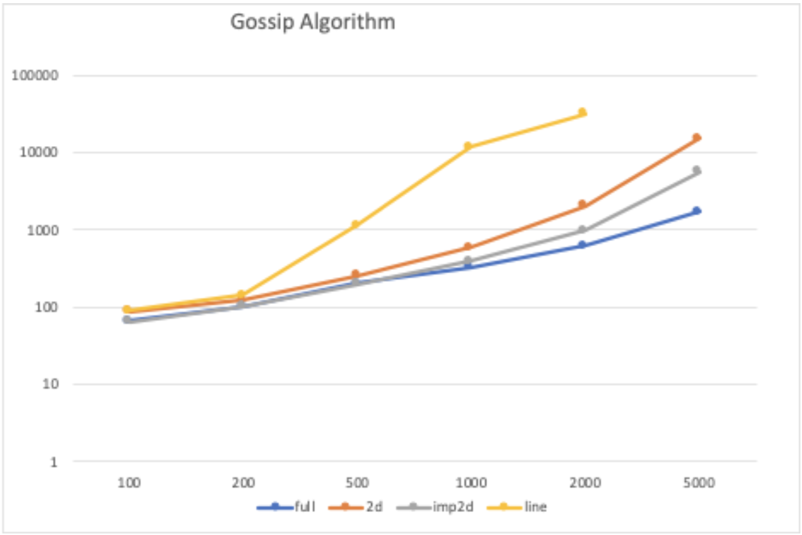
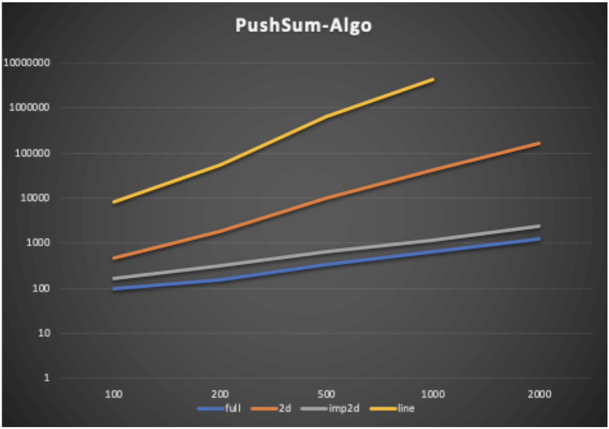

# Gossip-PushSum-Algorithm

In this project, we have implemented the Gossip as well as Push-Sum algorithms for topologies of verious sizes.

Gossip Protocol dictates that each node will send a rumor to its neighbours. After the nodes have received the rumour n number of times, it will stop transmitting further. The set of neighbours for each node varies accroding to the topoligies.

Push-Sum algorithm states that each node or actor will maintain two quantities s and w. s = Actor # initially and w = 1. The actor sends half of its s and w to its neighbours and keeps the other half.

## How to Run

Run the code using the following command:
```bash
dotnet fsi --langversion:preview main.fsx arg1 arg2 arg3
```
where arg1 = Number of nodes in the topology, arg2 = the topology to run, which is "full", "2D", "line" or "imp2D", arg3 = the algorithm to use, which is "gossip" or "push-sum"

If there is an incorrect input, the code will not run.

The code gives an output of how much time was needed for the nodes to converge for the given topology and algorithm.

## Largest Network

For Gossip:- 
  Full: 5000 nodes
  2D: 5000 nodes
  Imp2D: 5000 nodes
  Line: 2000 nodes

For Push-Sum:- 
  Full: 2000 nodes
  2D: 2000 nodes
  Imp2D: 1000 nodes
  Line: 2000 nodes

## Interesting Observations

### Gossip Algorithm:

Full topology is the fastes gossip algorithm.
When the number of nodes is 200 or less, all topologies converge in approximately the same time.
Imperfect2D topology is faster than 2D due to the introduction of the random neighbour which behaves as an extra transmission point for the gossip.
Line toplogy takes the longest time to converge as each node has only 2 neighbours and the graph also might disconnect if the middle node has received the message a certain number of times thus increasing the amount of time for execution

X-axis: Number of nodes
Y-axis: Total time for convergence in milliseconds
The graph was made logarithmic to the base 10.


| Number of Nodes | Full | 2D | Imp2D | Line |
| :---: | :---: | :---: | :---: | :---: |
| 100 | 66 | 88 | 68 | 90 |
| 200 | 102 | 123 | 102 | 143 |
| 500 | 202 | 200 | 200 | 1153 |
| 1000 | 327 | 591 | 388 | 11909 |
| 2000 | 613 | 2036 | 987 | 32000 |
| 5000 | 1730 | 15222 | 5632 |  |

### Push-Sum Algorithm

The timings work relatively similar to gossip.
The amount of time for Push-Sum line exponentially increases.
Full is the fastest algorithm.
In this algorithm, Imp2D is way faster than 2D.
The ratio approximately converges to (n + 1) / 2.
Line algorithm again takes the longest time as compare to the other topologies.



| Number of Nodes | Full | 2D | Imp2D | Line |
| :---: | :---: | :---: | :---: | :---: |
| 100 | 100 | 470 | 160 | 8265 |
| 200 | 156 | 1876 | 322 | 54519 |
| 500 | 342 | 9982 | 634 | 648915 |
| 1000 | 647 | 40638 | 1169 | 4181645 |
| 2000 | 1242 | 169315 | 2415 |  |
